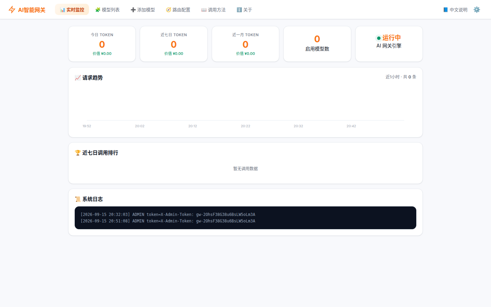

# aillm — AI Model Unified Management Gateway

[](LICENSE)
[](https://www.python.org/)

**aillm** is a local-first AI model gateway that runs entirely on your own machine. It consolidates
multiple model services (multiple vendors, multiple API keys) into a single management panel,
automatically routes requests to the most suitable model, fails over when a provider is down, and
exposes one OpenAI-compatible `/v1` endpoint that any AI client can plug into.

> **Local-first & bring-your-own-key.** aillm ships with no bundled channels, no remote manifests,
> no membership/subscription system, and no phone-home authorization. You supply the access (API keys);
> all data (keys, config, usage) stays in `data/config.json` on your machine.



## Comparison with one-api / new-api

Different tools for different jobs — pick by your primary need:

| | aillm | one-api | new-api |
|---|---|---|---|
| Purpose | local-first, single machine / single user | multi-user distribution & token quotas | multi-user distribution, more channels & features |
| Smart routing (pick model by task) | ✅ rule pre-filter + EWMA scoring | ⚠️ weight / priority based | ⚠️ similar |
| Auto failover (breaker + fallback chain) | ✅ native | ⚠️ simple retry | ⚠️ simple retry |
| Multi-key rotation / rate-limit spreading | ✅ round-robin + health stats | ✅ quota system | ✅ quota system |
| Multi-user / token quotas | ❌ single user (by design) | ✅ full | ✅ full + more |
| Multi-protocol translation | ✅ OpenAI/Anthropic/Gemini native | ⚠️ adapter-based, limited | ✅ broad channel coverage |
| Official endpoint templates | ✅ 16 vendors, click-to-fill | ❌ manual entry | ❌ manual entry |
| Database | ❌ single JSON file | SQLite / MySQL | SQLite / MySQL (+Redis optional) |
| Windows install | ✅ one-click exe / zip | ❌ needs a runtime stack | ❌ needs a runtime stack |

aillm focuses on the personal/local-first use case: no database, no user system, no built-in channels —
bring your own keys, get smart routing, automatic failover, protocol translation and a one-click desktop.

## Features

- **Unified model management** — manage vendors & keys in one place; enable/disable, group into
  pools (free / paid), inspect health at a glance
- **Smart routing** — automatically pick the best model for the task (fast rule-based pre-filter,
  optional LLM classifier)
- **Auto failover** — circuit breaker + configurable fallback chain; conversations keep running when
  a provider degrades or goes down
- **Official endpoint templates** — built-in list of official vendor endpoints; click to fill, then
  paste your own key; plus a free-tier section (official quota, key resigned at the vendor site)
  and no-key local self-hosted entries (Ollama / LM Studio / vLLM) that auto-fill `__KEYLESS__`
- **Cross-protocol translation** — transparent conversion between OpenAI / Anthropic / Gemini message formats
- **Token compression** — auto-truncate or summarize long contexts to save quota
- **Usage analytics** — today / 7-day / 30-day token trends and per-supplier breakdown
- **Client-agnostic** — standard `/v1` API; works with ChatBox, Immersive Translate, Dify, Coze, etc.
- **Optional Tauri desktop client** — tray resident, auto-start at login (`gateway-client/`)

## Quick Start

```bash
# Option A: run directly
pip install -r requirements.txt
python server.py                     # open http://127.0.0.1:18123/

# Option B: Docker
docker build -t aillm .              # build once
docker run -d -p 18123:18123 \
  -v aillm-data:/data \
  --name aillm aillm                 # data is kept in the aillm-data volume

# Option C: Tauri desktop client (optional)
cd gateway-client && npm install && npm run tauri dev
```

Smoke-test the gateway (any OpenAI-compatible client works):

```bash
curl http://127.0.0.1:18123/v1/chat/completions \
  -H "Content-Type: application/json" \
  -H "Authorization: Bearer local" \
  -d '{"model":"auto","messages":[{"role":"user","content":"hello"}]}'
```

> The Docker image listens on `0.0.0.0` by default (`AILLM_HOST` env var) and stores all config/keys
> under the mounted `/data` volume. No database required.

Open the panel and:

1. Go to the **Add Model Source** tab → expand *Official Endpoint Templates* → pick a vendor
   (the address is filled in automatically)
2. Paste **your own** API key → click *Fetch Models* → tick the models you need → *Save*
3. Chat in the browser, or point any OpenAI-compatible client at `http://127.0.0.1:18123/v1`
   with key `local` (use model `auto` for automatic selection, or a specific model ID)

> aillm does not provide or bundle any keyless model channel — the model service must come from your key.

## How It Works

Per-request routing chain: protocol detection → alias resolution (`auto`, `auto:free`) →
pool filtering → capability filtering → quota-aware ordering (paid before free) → circuit-breaker
check → round-robin key selection → outbound protocol conversion, with automatic fallback on failure.

```
Client request                                model=auto
  │
  ├ ① alias resolution        auto / auto:<pool> / alias expressions (#5)
  ├ ② pool filter             only enabled suppliers in the selected pool
  ├ ③ capability filter       vision / long-context / reasoning / code (#5)
  ├ ④ quota ordering          unlimited (paid) first, limited (free) later (#2)
  ├ ⑤ circuit breaker         skip suppliers in open state (#1)
  ├ ⑥ key polling             round-robin across keys; per-key supported models (#3)
  ├ ⑦ outbound adapter        openai/anthropic/gemini conversion (#10); per-supplier proxy (#4)
  │
  ├─ ok    → health stats + usage accounting
  └─ fail  → breaker count+1 → next candidate on fallback chain → 502 if exhausted
```

## Configuration

- Everything lives in `data/config.json` (auto-created on first run)
- Structural fields (e.g. `port`) require a restart; hot fields (suppliers, pools, prompt, compression) apply immediately
- Port conflict: change `"port"`; LAN access: set `"bindHost": "0.0.0.0"`

## API Surface

| Method & Path | Notes |
|---|---|
| `GET /api/health` | supplier health & breaker state |
| `GET /api/version` | version info |
| `GET/POST /api/config` | read / write full config |
| `GET /api/metrics?minutes=30` | request volume curve |
| `GET /api/logs?lines=300` | tail of gateway log |
| `POST /api/supplier/test` | test connectivity & pull model list |
| `POST /api/suppliers/upsert` | add / update a supplier |
| `DELETE /api/suppliers/{id}` | remove a supplier |
| `POST /v1/chat/completions` | OpenAI-compatible chat endpoint (streaming supported) |

## Project Structure

```
server.py                FastAPI gateway entry
client.py                CLI helper
core/                    config / router / breaker / protocols / token_compress /
                         prober / smart_router / proxy / model_params / stats
web/                     management panel (single-file web UI)
gateway-client/          optional Tauri desktop client
packaging/               PyInstaller / Inno / deb build tooling
tests/                   offline unit tests
```

## Development

```bash
# offline unit tests (no external services required)
python -m unittest discover -s tests
```

## Compliance

aillm is local-only software. Please ensure any model service you connect complies with the provider's
terms of service and the laws of your jurisdiction; if you offer access to others, assess and bear the
corresponding obligations yourself.

## License

[Apache-2.0](LICENSE) © yysoulhaha and aillm contributors